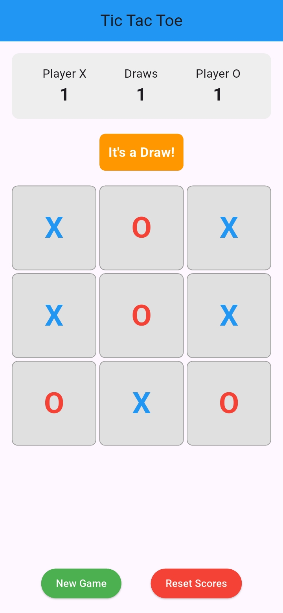
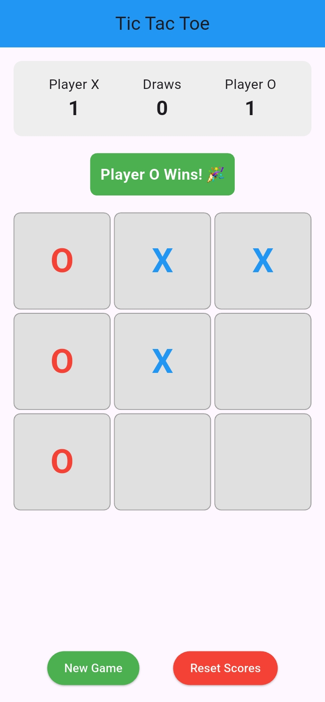
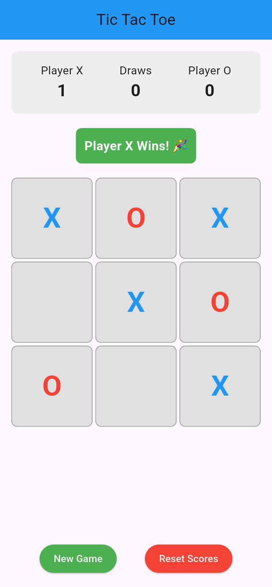
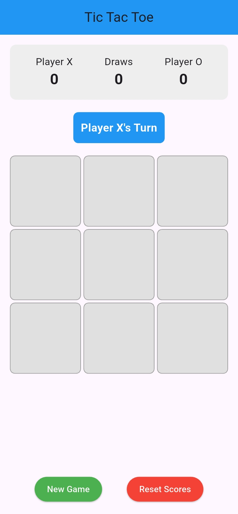

# 🎮 Simple Tic Tac Toe - Flutter App

A clean, beginner-friendly Tic Tac Toe game built with Flutter. Perfect for learning Flutter development or just having fun!

## 📱 Features

- **Classic 3x3 Tic Tac Toe gameplay**
- **Score tracking** - Keep track of wins for both players and draws
- **Clean, intuitive UI** - Easy to understand and navigate
- **Responsive design** - Works on different screen sizes
- **Game state management** - Proper turn switching and win detection
- **Reset functionality** - Start new games or reset scores anytime

## 🎯 How to Play

1. **Player X always goes first**
2. **Tap any empty cell** to place your symbol (X or O)
3. **Take turns** with your opponent
4. **Win by getting 3 in a row** - horizontally, vertically, or diagonally
5. **If all 9 cells are filled** without a winner, it's a draw!
6. **Use "New Game"** to play another round
7. **Use "Reset Scores"** to clear the scoreboard

## 🛠️ Technical Details

### **Built With:**
- **Flutter** - Google's UI toolkit for building natively compiled applications
- **Dart** - Programming language optimized for building mobile apps

### **Key Components:**
- `StatefulWidget` for managing game state
- `GridView.builder` for creating the 3x3 game board
- `GestureDetector` for handling tap interactions
- Custom game logic for win detection and turn management

### **App Structure:**
```
lib/
└── main.dart          # Main app file containing all game logic
```

## 🚀 Getting Started

### **Prerequisites:**
- Flutter SDK installed on your machine
- Android Studio / VS Code with Flutter extensions
- A device or emulator to run the app

### **Installation:**

1. **Clone or download** this project
2. **Navigate to the project directory**
3. **Install dependencies:**
   ```bash
   flutter pub get
   ```
4. **Run the app:**
   ```bash
   flutter run
   ```

### **Building for Release:**
```bash
# For Android
flutter build apk

# For iOS  
flutter build ios
```

## 📖 Learning Resources

This app is perfect for beginners learning Flutter! Here's what you can learn:

### **Flutter Concepts Covered:**
- **StatefulWidget vs StatelessWidget**
- **State management with setState()**
- **Layout widgets** (Column, Row, Container, etc.)
- **Interactive widgets** (GestureDetector, ElevatedButton)
- **List operations** and data manipulation
- **Conditional rendering** based on game state

### **Programming Concepts:**
- **Game logic implementation**
- **Array/List manipulation**
- **Conditional statements** and loops
- **Function organization** and separation of concerns
- **UI state synchronization**

## 🎨 Customization Ideas

Want to make this app your own? Try these modifications:

### **Easy Modifications:**
- Change colors and themes
- Modify text styles and fonts
- Add different sound effects
- Change player symbols (instead of X and O)

### **Intermediate Additions:**
- Add player name input
- Implement different board sizes (4x4, 5x5)
- Add game timer functionality
- Create different difficulty AI opponents

### **Advanced Features:**
- Online multiplayer capability
- Game history and statistics
- Animations and visual effects
- Tournament mode with multiple rounds

## 📝 Code Structure Explanation

### **Main Variables:**
- `board` - Stores the current state of all 9 cells
- `currentPlayer` - Tracks whose turn it is
- `isGameOver` - Prevents moves after game ends
- `winner` - Stores the result of the game

### **Key Functions:**
- `makeMove()` - Handles player input and game progression
- `checkForWinner()` - Analyzes board for winning patterns
- `startNewGame()` - Resets board for new round
- `resetAllScores()` - Clears all score counters

### **UI Components:**
- **Score Display** - Shows current wins/draws count
- **Game Status** - Indicates current player or winner
- **Game Board** - Interactive 3x3 grid
- **Action Buttons** - New game and reset functionality



